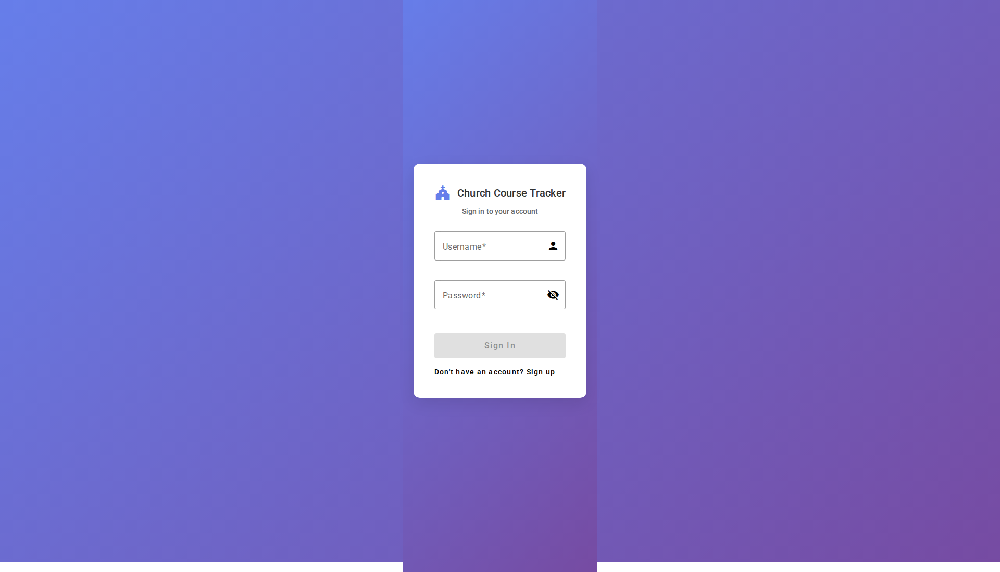
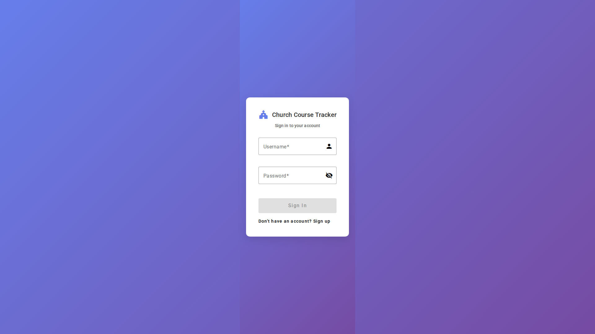
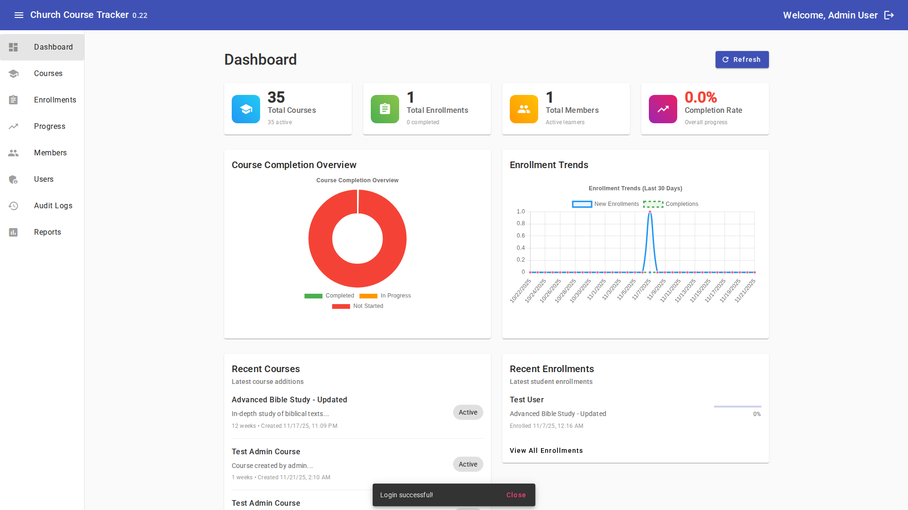

# Getting Started with Church Course Tracker

Welcome! This guide will help you get started with the Church Course Tracker. Whether you're an administrator, staff member, or a church member taking courses, this guide will walk you through the basics.

!!! tip "New User?"
    If this is your first time using the system, start here! This guide covers everything you need to know to begin using Church Course Tracker effectively.

## 🌐 Accessing the Application

1. Open your web browser (Chrome, Firefox, Safari, or Edge all work)
2. Go to: **https://apps.quentinspencer.com**
3. You'll see the login page

*The login page is the first thing you'll see when accessing the application*

## 🔐 Logging In

### First Time Login

If this is your first time using the system, you'll need login credentials from your administrator. They will provide you with:
- A **username**
- A **password**

### Logging In

1. Enter your username in the "Username" field
2. Enter your password in the "Password" field
3. Click the "Login" button

*Enter your credentials and click Login to access the system*

!!! warning "Forgot Your Password?"
    If you forget your password, contact your administrator to reset it. Do not share your password with anyone.

## 🏠 Understanding the Dashboard

After logging in, you'll see the **Dashboard**. This is your main starting point and shows:

- **Quick Overview** - Summary of courses, enrollments, and activity
- **Recent Activity** - What's been happening in the system
- **Navigation Menu** - Links to different parts of the application

*The dashboard provides a quick overview of system activity and quick access to key features*

## 🧭 Navigation Basics

The main menu is typically located at the top or side of the screen. Here are the main sections you'll see:

*The navigation menu provides access to all major features of the application*

### For All Users:
- **Dashboard** - Your home page with overview information
- **Courses** - View and browse available courses
- **My Progress** - Track your own course progress
- **Profile** - View and update your account information

### For Staff and Administrators:
- **Enrollments** - Manage who is enrolled in courses
- **Members** - View and manage church members
- **Reports** - Generate reports and analytics
- **Activity Logs** - View system activity

### For Administrators Only:
- **Users** - Manage user accounts and permissions
- **Audit Logs** - View detailed system audit information

## 📚 Your First Steps

### As a Church Member (Viewer):

1. **Browse Courses**
   - Click on "Courses" in the menu
   - Browse the list of available courses
   - Click on a course to see details

2. **Enroll in a Course**
   - Find a course you're interested in
   - Click "Enroll" or "Enroll Now"
   - Confirm your enrollment

3. **Access Course Content**
   - Go to "My Progress" to see your enrolled courses
   - Click on a course to access its content
   - Start working through the materials

### As a Staff Member:

1. **Create a Course**
   - Click on "Courses" in the menu
   - Click "Create New Course" or the "+" button
   - Fill in the course information (name, description, etc.)
   - Save the course

2. **Add Content to a Course**
   - Open the course you created
   - Go to the "Content" section
   - Upload materials (videos, documents, etc.)

3. **Enroll Members**
   - Go to "Enrollments"
   - Click "New Enrollment"
   - Select a member and a course
   - Complete the enrollment

### As an Administrator:

1. **Set Up Users**
   - Go to "Users" in the menu
   - Click "Add User" or "Create User"
   - Enter user information and assign a role
   - Save the user

2. **Review System Activity**
   - Check the Dashboard for system overview
   - Review Activity Logs for recent changes
   - Check Audit Logs for detailed activity history

## 💡 Tips for Success

!!! tip "Getting the Most Out of the System"
    - **Take Your Time** - Don't rush. Explore the system to get familiar with it
    - **Use the Search** - Most pages have a search feature to help you find things quickly
    - **Check Your Profile** - Make sure your profile information is up to date
    - **Ask for Help** - If you're stuck, don't hesitate to ask your administrator or staff member

## ❓ Common Questions

!!! question "I can't log in"
    - Double-check your username and password
    - Make sure Caps Lock is not on
    - Contact your administrator if you've forgotten your password

!!! question "I don't see a course I'm looking for"
    - Check with staff to see if the course is available
    - Make sure you're enrolled in the course (if enrollment is required)

!!! question "I can't access course content"
    - Verify you're enrolled in the course
    - Check with staff if there are any access restrictions
    - Make sure you're logged in

!!! question "Where do I see my progress?"
    - Click on "My Progress" in the main menu
    - You'll see all your enrolled courses and your completion status

## 🎯 Next Steps

Now that you know the basics:

1. **Explore the Dashboard** - Get familiar with the overview information
2. **Check Your Profile** - Make sure your information is correct
3. **Browse Courses** - See what courses are available
4. **Read the User Guide** - For detailed instructions on specific features

## 📖 More Help

For more detailed information:
- See the [User Guide](user-guide.md) for step-by-step instructions on all features
- Check the [Features Overview](features.md) to learn what the system can do
- Contact your administrator for account-specific questions

---

**Remember**: The system is designed to be user-friendly. If something doesn't make sense, don't worry - you can always ask for help!

