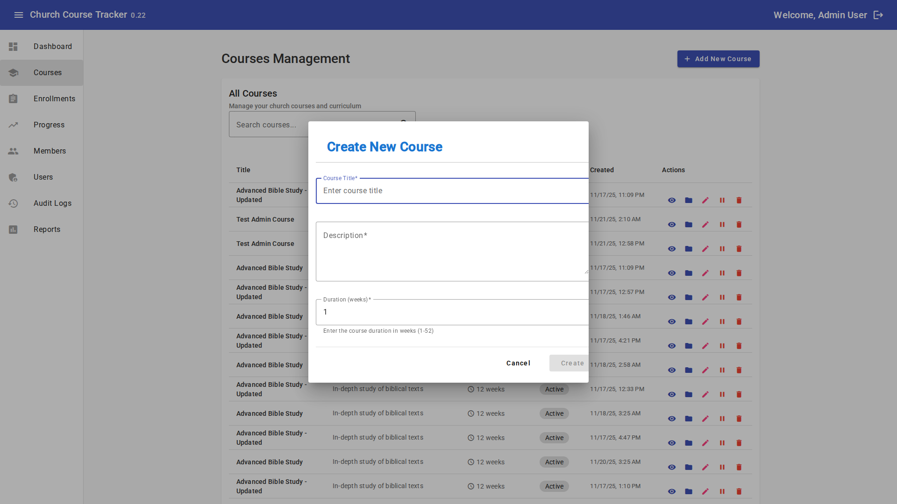
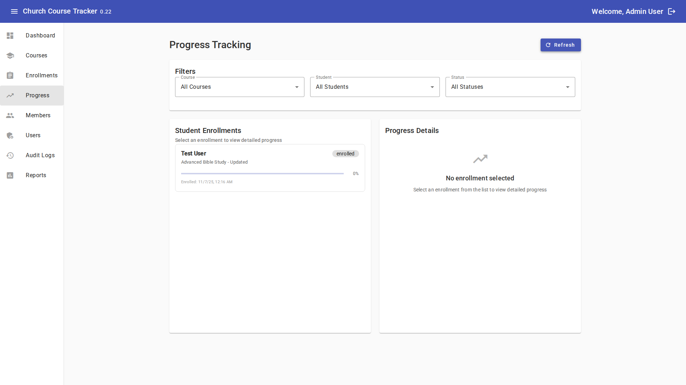

# Church Course Tracker - User Guide

This comprehensive guide will walk you through all the features of the Church Course Tracker. Each section explains how to use specific features in clear, easy-to-understand language.

!!! info "Complete Reference"
    This guide covers every feature in detail. Use the table of contents on the left to jump to specific sections, or use the search function to find what you're looking for.

!!! tip "Quick Navigation"
    Use the table of contents on the left to jump to any section, or use the search function to find specific topics.

## Table of Contents

This guide covers all features of the Church Course Tracker:

1. [Dashboard](#dashboard) - Overview and quick access
2. [Courses](#courses) - Creating and managing courses
3. [Programs](#programs) - Creating and managing mentoring/discipleship programs
4. [Enrollments](#enrollments) - Managing course enrollments
5. [Progress Tracking](#progress-tracking) - Monitoring member progress
6. [Content Management](#content-management) - Uploading and organizing content
7. [Members](#members) - Managing member information
8. [Reports](#reports) - Generating reports and analytics
9. [User Management](#user-management) - Managing system users (Admin only)
10. [System Settings](#system-settings) - Configuring system settings (Admin only)
11. [Profile Settings](#profile-settings) - Updating your profile
12. [Activity and Audit Logs](#activity-and-audit-logs) - Viewing system activity

---

## Dashboard

The Dashboard is your home page when you log in. It provides a quick overview of what's happening in the system.

### What You'll See

- **Summary Statistics** - Total courses, enrollments, active members
- **Recent Activity** - Latest actions taken in the system
- **Quick Links** - Fast access to common tasks
- **Notifications** - Important updates or messages

### How to Use It

- **View Overview** - Simply look at the dashboard to get a sense of system activity
- **Navigate Quickly** - Click on any summary number or link to go to that section
- **Check Activity** - Review recent activity to stay informed

---

## Courses

Courses are the heart of the system. This is where you create, manage, and access educational content.

### Viewing Courses

1. Click "Courses" in the main menu
2. You'll see a list of all available courses
3. Use the search box to find specific courses
4. Click on a course name to see details

### Creating a Course (Staff & Administrators)

1. Go to the Courses page
2. Click "Create New Course" or the "+" button
3. Fill in the course information:
   - **Course Name** - The title of the course
   - **Description** - What the course is about
   - **Category** - Optional category to organize courses
   - **Status** - Active or Inactive
4. Click "Save" or "Create"

*The course creation form allows you to enter all the necessary information for a new course*

### Editing a Course (Staff & Administrators)

1. Find the course you want to edit
2. Click on the course name or the "Edit" button
3. Make your changes
4. Click "Save"

### Deleting a Course (Administrators Only)

!!! danger "Permanent Action"
    Deleting a course will remove it and all associated data. This cannot be undone. Only administrators can delete courses.

1. Find the course you want to delete
2. Click "Delete" (this option is only available to administrators)
3. Confirm the deletion

### Course Details

When you view a course, you'll see:
- Course description and information
- Enrolled members
- Course content and materials
- Progress statistics

---

## Programs

Programs are designed for managing mentoring and discipleship programs, which differ from courses in that they focus on relationship-based learning with participants, pairings (like mentor-mentee relationships), sessions, and progress tracking.

### Viewing Programs

1. Click "Programs" in the main menu
2. You'll see a list of all available programs
3. Use the search box to find specific programs
4. Click on a program name to see details

### Creating a Program (Staff & Administrators)

1. Go to the Programs page
2. Click "Add New Program" or the "+" button
3. Fill in the program information:
   - **Program Title** - The name of the program
   - **Description** - What the program is about
   - **Status** - Active or Inactive
4. Click "Save" or "Create"

### Importing Programs from Planning Center

1. Go to the Programs page
2. Click "Import Program from Planning Center"
3. Select the Planning Center event or list
4. Review and map attributes using the attribute mapping dialog
5. Complete the import

### Managing Program Participants

1. Open a program
2. Click "Manage Participants" or the participants icon
3. You can:
   - **Add Participants** - Import from Planning Center or add manually
   - **Remove Participants** - Remove participants from the program
   - **View Participant Details** - See participant information and custom attributes

### Managing Program Pairings

Program pairings allow you to create relationships between participants, such as mentor-mentee pairs.

1. Open a program
2. Click "Manage Pairings" or the pairings icon
3. You can:
   - **Create Pairings** - Link participants together (e.g., mentor and mentee)
   - **View Existing Pairings** - See all current pairings in the program
   - **Remove Pairings** - Delete pairings when relationships end

### Managing Program Sessions

Sessions are scheduled meetings or events within a program.

1. Open a program
2. Click "Manage Sessions" or the sessions icon
3. You can:
   - **Create Sessions** - Add new sessions with dates and details
   - **Edit Sessions** - Update session information
   - **Delete Sessions** - Remove sessions that are no longer needed

### Managing Program Progress

1. Open a program
2. Click "Manage Progress" or the progress icon
3. View and update progress for all participants
4. Track completion status and milestones

### Editing a Program (Staff & Administrators)

1. Find the program you want to edit
2. Click on the program name or the "Edit" button
3. Make your changes
4. Click "Save"

### Deleting a Program (Administrators Only)

!!! danger "Permanent Action"
    Deleting a program will remove it and all associated data. This cannot be undone. Only administrators can delete programs.

1. Find the program you want to delete
2. Click "Delete" (this option is only available to administrators)
3. Confirm the deletion

### Program Details

When you view a program, you'll see:
- Program description and information
- Participants list
- Pairings information
- Sessions schedule
- Progress statistics
- Program content and materials

---

## Enrollments

Enrollments connect members to courses. This is how you track who is taking which courses.

### Viewing Enrollments

1. Click "Enrollments" in the main menu
2. You'll see a list of all enrollments
3. Filter by course or member using the search/filter options

### Enrolling a Member (Staff & Administrators)

1. Go to the Enrollments page
2. Click "New Enrollment" or "Enroll Member"
3. Select:
   - **Member** - Choose the person to enroll
   - **Course** - Choose the course
   - **Status** - Active, Completed, or Withdrawn
4. Click "Save" or "Enroll"

### Self-Enrollment (All Users)

1. Go to the Courses page
2. Find a course you want to take
3. Click "Enroll" or "Enroll Now"
4. Confirm your enrollment

### Updating Enrollment Status

1. Find the enrollment you want to update
2. Click "Edit" or click on the enrollment
3. Change the status (Active, Completed, Withdrawn)
4. Click "Save"

### Removing an Enrollment

1. Find the enrollment
2. Click "Remove" or "Withdraw"
3. Confirm the action

---

## Progress Tracking

Progress tracking helps you see how members are doing in their courses.

### Viewing Your Own Progress (All Users)

1. Click "Progress" in the main menu
2. You'll see all courses you're enrolled in
3. Each course shows:
   - Completion percentage
   - Modules completed
   - Overall status

*The progress page shows your completion status for all enrolled courses*

### Viewing Member Progress (Staff & Administrators)

1. Go to the Progress page (or Members page)
2. Find the member you want to check
3. Click on their name or "View Progress"
4. See their progress across all enrolled courses

### Understanding Progress Indicators

- **Percentage Complete** - Shows how much of the course is finished
- **Status** - Active, Completed, or Not Started
- **Last Activity** - When the member last accessed the course

### Marking Content as Complete

1. Access the course content
2. Work through the materials
3. The system automatically tracks when you complete modules
4. Some content may require you to mark it as complete manually

---

## Content Management

Content management lets you add and organize course materials like videos, documents, and other resources.

### Viewing Course Content

1. Open a course
2. Click on the "Content" tab or section
3. You'll see all materials organized by modules

### Adding Content (Staff & Administrators)

1. Open the course you want to add content to
2. Go to the Content section
3. Click "Add Content" or "Upload"
4. Choose what to add:
   - **Upload File** - For documents, PDFs, images
   - **Add Video** - Link to video content
   - **Add Module** - Create a new section
5. Fill in the content details:
   - Title
   - Description
   - File or link
6. Click "Save"

### Organizing Content

- **Create Modules** - Group related content together
- **Reorder** - Drag and drop to change the order
- **Edit** - Update content information
- **Delete** - Remove content (be careful - this cannot be undone)

### Content Types

The system supports:
- **Documents** - PDFs, Word documents, etc.
- **Videos** - Links to video content
- **Images** - Photos and graphics
- **Links** - External resources

---

## Members

The Members section helps you manage information about church members who use the system.

### Viewing Members (Staff & Administrators)

1. Click "Members" in the main menu
2. You'll see a list of all members
3. Use search to find specific members

### Member Information

When you view a member, you'll see:
- Contact information
- Enrolled courses
- Progress across courses
- Activity history

### Adding a Member (Staff & Administrators)

1. Go to the Members page
2. Click "Add Member" or "New Member"
3. Enter member information:
   - Name
   - Email (if available)
   - Other contact information
4. Click "Save"

### Editing Member Information

1. Find the member
2. Click "Edit"
3. Update the information
4. Click "Save"

---

## Reports

Reports help you understand how your courses are performing and how members are engaging.

### Accessing Reports (Staff & Administrators)

1. Click "Reports" in the main menu
2. Choose the type of report you want:
   - **Enrollment Reports** - Who's enrolled in what
   - **Completion Reports** - Course completion statistics
   - **Progress Reports** - Member progress overview
   - **Activity Reports** - System usage statistics

### Generating a Report

1. Select the report type
2. Choose your filters:
   - Date range
   - Specific courses
   - Specific members
3. Click "Generate Report"
4. Review the results
5. Export if needed (PDF, Excel, etc.)

### Understanding Report Data

- **Enrollment Numbers** - How many people are enrolled
- **Completion Rates** - Percentage of members who completed courses
- **Engagement Metrics** - How actively members are using the system
- **Trends** - Changes over time

---

## User Management

User management is for administrators to control who can access the system and what they can do.

### Viewing Users (Administrators Only)

1. Click "Users" in the main menu
2. See all system users
3. View their roles and status

### Creating a User (Administrators Only)

1. Go to the Users page
2. Click "Add User" or "Create User"
3. Enter user information:
   - Username
   - Password
   - Email
   - Role (Administrator, Staff, or Viewer)
4. Click "Save"

### User Roles

- **Administrator** - Full access to everything
- **Staff** - Can manage courses and enrollments, but not users
- **Viewer** - Can view courses and track their own progress

### Editing Users

1. Find the user
2. Click "Edit"
3. Update information or change role
4. Click "Save"

### Resetting Passwords (Administrators Only)

1. Find the user
2. Click "Reset Password" or "Change Password"
3. Enter a new password
4. Save the changes
5. Inform the user of their new password

### Deactivating Users

1. Find the user
2. Click "Deactivate" or change status to "Inactive"
3. Confirm the action

**Note**: Deactivated users cannot log in but their data is preserved.

---

## System Settings

System Settings allow administrators to configure various aspects of the system, including Planning Center integration, security policies, and backup settings.

!!! warning "Administrator Only"
    Only users with Administrator role can access and modify system settings.

### Accessing System Settings

1. Click "System Settings" in the main menu (Administrators only)
2. You'll see different categories of settings organized in tabs

### System Settings Categories

#### System Settings
- **Application Name** - The name of your application
- **Application Version** - Current version information
- **Environment** - Current environment (production, development, etc.)
- **Debug Mode** - Enable or disable debug logging
- **Session Timeout** - How long users can be inactive before being logged out
- **Max Upload Size** - Maximum file size for uploads
- **Log Level** - Level of detail in system logs

#### Planning Center Integration
- **API URL** - Planning Center API endpoint
- **App ID** - Your Planning Center application ID
- **Secret** - Planning Center secret key (hidden for security)
- **Access Token** - Planning Center access token (hidden for security)
- **Max Events** - Maximum number of events to fetch
- **Cache TTL** - How long to cache Planning Center data
- **Use Mock** - Enable mock mode for testing

#### Security Settings
- **Password Requirements**:
  - Minimum length
  - Require uppercase letters
  - Require lowercase letters
  - Require numbers
  - Require special characters
- **Account Lockout**:
  - Lockout attempts (number of failed logins before lockout)
  - Lockout duration (how long accounts stay locked)
- **Session Management**:
  - Idle timeout (automatic logout after inactivity)
- **Rate Limiting**:
  - Enable/disable rate limiting
  - Requests per window
  - Time window duration

#### Backup Settings
- **Backup Enabled** - Turn automatic backups on or off
- **Backup Frequency** - How often backups run (in days)
- **Backup Retention** - How long to keep backups (in days)
- **Maintenance Window** - Time window for backup operations

### Saving Settings

1. Navigate to the category you want to modify
2. Make your changes
3. Click "Save" for that category
4. You'll see a confirmation message when settings are saved

!!! tip "Settings Validation"
    The system validates all settings before saving. If there are errors, they will be highlighted and you'll need to fix them before saving.

### Planning Center Configuration

When configuring Planning Center integration:
- Enter your API credentials carefully
- Secret values are masked for security (click the eye icon to reveal)
- Test the connection after saving
- Use mock mode for testing without connecting to Planning Center

---

## Profile Settings

Your profile contains your personal information and account settings.

### Accessing Your Profile

1. Click on your name or "Profile" in the menu (usually in the top right)
2. You'll see your profile information

### Updating Your Information

1. Go to your Profile
2. Click "Edit"
3. Update any information:
   - Name
   - Email
   - Password
   - Other preferences
4. Click "Save"

### Changing Your Password

1. Go to your Profile
2. Click "Change Password"
3. Enter your current password
4. Enter your new password (twice for confirmation)
5. Click "Save"

**Security Tip**: Use a strong password with a mix of letters, numbers, and symbols.

---

## Activity and Audit Logs

Activity and audit logs help you see what's happening in the system.

### Viewing Activity Logs (Staff & Administrators)

1. Click "Activity Logs" in the main menu
2. See recent system activity
3. Filter by date, user, or action type

### Viewing Audit Logs (Administrators Only)

1. Click "Audit Logs" in the main menu
2. See detailed records of all system changes
3. Filter and search for specific events

### What's Logged

- User logins and logouts
- Course creation and updates
- Enrollment changes
- Content uploads
- User management actions
- System configuration changes

### Using Logs

- **Troubleshooting** - Find out what happened when something goes wrong
- **Security** - Monitor for unauthorized access
- **Compliance** - Keep records of system activity
- **Analysis** - Understand how the system is being used

---

## Tips and Best Practices

### For All Users

- **Keep Your Profile Updated** - Make sure your information is current
- **Check Progress Regularly** - Stay on top of your course completion
- **Use Search** - Most pages have search to help you find things quickly
- **Ask for Help** - Don't hesitate to contact staff or administrators

### For Staff

- **Organize Content Well** - Use clear module names and descriptions
- **Keep Courses Updated** - Remove outdated content
- **Monitor Progress** - Check on member progress regularly
- **Communicate** - Let members know about new courses or updates

### For Administrators

- **Review Logs Regularly** - Check activity and audit logs for issues
- **Manage Users Carefully** - Only give administrator access to trusted staff
- **Back Up Data** - Ensure regular backups are configured
- **Monitor System Health** - Keep an eye on system performance

---

## Troubleshooting

### Common Issues

**"I can't log in"**
- Check your username and password
- Make sure Caps Lock is off
- Contact your administrator

**"I can't see a course"**
- Verify you're enrolled (if enrollment is required)
- Check with staff about course availability
- Make sure the course is active

**"Content won't load"**
- Check your internet connection
- Try refreshing the page
- Clear your browser cache
- Contact support if the problem persists

**"I can't upload a file"**
- Check the file size (there may be limits)
- Verify the file type is supported
- Make sure you have permission to upload content

---

## Getting More Help

If you need additional assistance:

1. **Check This Guide** - Review the relevant section
2. **Contact Staff** - Reach out to your church staff
3. **Contact Administrator** - For account or permission issues
4. **Review Getting Started** - Go back to basics with the [Getting Started Guide](getting-started.md)

---

**Remember**: The system is designed to be intuitive. Take your time, explore, and don't be afraid to ask questions!

