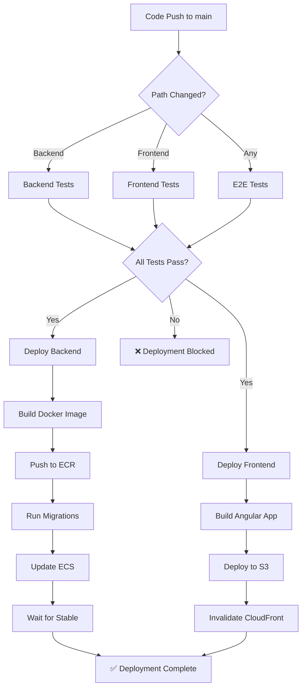

# 🔄 CI/CD Pipeline Status Report

## 📊 **Current Status: READY TO ACTIVATE**

The CI/CD pipeline has been **fully restored and configured** but is **not yet active** because the workflow files haven't been committed to the repository.

---

## 🏗️ **Pipeline Components**

### ✅ **1. Backend Tests** (`.github/workflows/backend-tests.yml`)
- **Status**: Configured ✅
- **Triggers**: 
  - Push to `main`/`develop` branches (backend changes only)
  - Pull requests to `main`
- **Actions**:
  - Python 3.11 setup
  - Install dependencies
  - Run linting (flake8, black, isort)
  - Run tests with coverage
  - Upload coverage to Codecov
- **Dependencies**: `requirements.txt`

### ✅ **2. Frontend Tests** (`.github/workflows/frontend-tests.yml`)
- **Status**: Configured ✅
- **Triggers**: 
  - Push to `main`/`develop` branches (frontend changes only)
  - Pull requests to `main`
- **Actions**:
  - Node.js 18 setup
  - Install dependencies
  - Run linting
  - Run tests (headless)
  - Build verification
- **Dependencies**: `frontend/church-course-tracker/package.json`

### ✅ **3. E2E Tests** (`.github/workflows/e2e-tests.yml`)
- **Status**: Configured ✅
- **Triggers**: 
  - Push to `main` branch
  - Pull requests to `main`
  - Daily at 2 AM UTC (scheduled)
  - Manual dispatch
- **Actions**:
  - Node.js 18 setup
  - Install Playwright browsers
  - Run E2E tests against production
  - Upload test reports and screenshots
- **Target**: `https://apps.quentinspencer.com`

### ✅ **4. Deploy** (`.github/workflows/deploy.yml`)
- **Status**: Configured ✅
- **Triggers**: 
  - Push to `main` branch
  - Manual dispatch
- **Actions**:
  - **Backend Deploy**:
    - Build Docker image
    - Push to ECR
    - Run database migrations
    - Update ECS service
    - Wait for stability
  - **Frontend Deploy**:
    - Build Angular app
    - Deploy to S3
    - Invalidate CloudFront cache

---

## 🔧 **Required GitHub Secrets**

The pipeline requires these secrets to be configured in GitHub:

### **AWS Credentials**
- `AWS_ACCESS_KEY_ID` - AWS access key
- `AWS_SECRET_ACCESS_KEY` - AWS secret key

### **Application Secrets**
- `DATABASE_URL` - PostgreSQL connection string
- `S3_STATIC_BUCKET` - S3 bucket for static files
- `CLOUDFRONT_DISTRIBUTION_ID` - CloudFront distribution ID

### **Optional (for enhanced features)**
- `CODECOV_TOKEN` - For coverage reporting
- `SLACK_WEBHOOK_URL` - For notifications

---

## 🚨 **Current Issues**

### **1. Workflows Not Committed**
```bash
# Status: UNCOMMITTED
# Location: .github/workflows/
# Files: 4 workflow files created but not in git
```

### **2. Database Migration Issues**
- **Problem**: Alembic migration conflicts
- **Error**: "Multiple head revisions are present"
- **Impact**: ECS tasks failing to start
- **Solution Needed**: Resolve migration heads

### **3. API Gateway Connection**
- **Problem**: VPC Link status shows "None"
- **Impact**: API Gateway returning 503 errors
- **Solution Needed**: VPC Link configuration

---

## 📈 **Pipeline Flow**



---

## 🎯 **Activation Steps**

### **Step 1: Commit Workflows**
```bash
git add .github/
git commit -m "feat: restore CI/CD pipeline with GitHub Actions workflows"
git push origin main
```

### **Step 2: Configure GitHub Secrets**
1. Go to GitHub repository settings
2. Navigate to "Secrets and variables" → "Actions"
3. Add required secrets (see list above)

### **Step 3: Fix Database Issues**
```bash
# Connect to database and resolve migration conflicts
# This needs to be done manually or via a migration fix script
```

### **Step 4: Verify Pipeline**
- Push a test commit to trigger workflows
- Monitor GitHub Actions tab
- Check deployment status

---

## 📊 **Expected Performance**

### **Test Execution Times**
- **Backend Tests**: ~3-5 minutes
- **Frontend Tests**: ~2-3 minutes  
- **E2E Tests**: ~5-10 minutes
- **Deployment**: ~8-12 minutes

### **Total Pipeline Time**
- **Full Pipeline**: ~15-20 minutes
- **Backend Only**: ~10-15 minutes
- **Frontend Only**: ~8-12 minutes

---

## 🔍 **Monitoring & Notifications**

### **Built-in Monitoring**
- ✅ GitHub Actions status checks
- ✅ Test coverage reports
- ✅ Deployment logs
- ✅ Artifact storage (30 days)

### **Recommended Additions**
- Slack notifications for failures
- Email alerts for production issues
- CloudWatch alarms for infrastructure

---

## 🛠️ **Troubleshooting Guide**

### **Common Issues**

#### **1. Tests Failing**
```bash
# Check locally first
cd backend && pytest tests/ -v
cd frontend/church-course-tracker && npm test
npx playwright test
```

#### **2. Deployment Failures**
```bash
# Check AWS credentials
aws sts get-caller-identity

# Check ECS service status
aws ecs describe-services --cluster church-course-tracker-cluster
```

#### **3. Migration Issues**
```bash
# Check migration status
cd backend
alembic heads
alembic current
```

---

## 📋 **Next Actions Required**

### **Immediate (High Priority)**
1. ✅ **Commit workflow files** to activate pipeline
2. 🔧 **Configure GitHub secrets** for deployment
3. 🛠️ **Fix database migration conflicts**
4. 🔗 **Resolve API Gateway VPC Link issues**

### **Short Term (Medium Priority)**
1. 📊 **Add monitoring and alerting**
2. 📝 **Set up branch protection rules**
3. 🔄 **Configure automated dependency updates**
4. 📈 **Add performance testing**

### **Long Term (Low Priority)**
1. 🏗️ **Multi-environment deployment**
2. 🧪 **Feature flag integration**
3. 📊 **Advanced analytics and reporting**
4. 🔐 **Security scanning integration**

---

## ✅ **Success Criteria**

The CI/CD pipeline will be considered **fully operational** when:

- [ ] All workflow files committed to repository
- [ ] GitHub secrets configured
- [ ] Database migration issues resolved
- [ ] API Gateway connectivity working
- [ ] All tests passing in pipeline
- [ ] Successful deployment to production
- [ ] E2E tests running against live environment

---

## 📞 **Support**

**Repository**: `https://github.com/qspencer/church-course-tracker.git`

**Key Files**:
- `.github/workflows/` - All CI/CD workflows
- `docs/CI_CD_SETUP.md` - Detailed setup guide
- `backend/alembic/` - Database migrations
- `infrastructure/` - Terraform configuration

**Current Status**: **Ready to activate** - Just needs commits and secrets configuration!

---

*Last Updated: October 13, 2025*
*Pipeline Status: Configured but Inactive*
